```{r setup, include=FALSE}
knitr::opts_chunk$set(
  echo       = TRUE,
  message    = FALSE,
  warning    = FALSE,
  out.width  = "100%",
  fig.asp    = 0.518, 
  fig.show   = "hold",
  fig.pos    = "center",
  fig.align  = "center",
  dpi        = 600
)

options(
  digits = 3,
  knitr.table.format = "html"
)
```


---
## 我们的目标论文

```{r, echo=FALSE}

```

.center[<https://doi.org/10.1037/pspa0000368>]


---
## .red[双刃剑]模型

文章提出一个.red[双刃剑]模型**捕捉**怀旧的双重性:

- 怀旧会通过增加对变革的怀疑来.blue[降低]对创新技术的好感度。
- 同时，怀旧通过增加社会联系.orange[促进]了对创新技术反应的好感度。


<br>
```{r, echo=FALSE, out.width = "60%"}
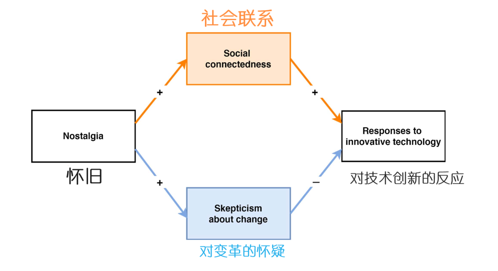
```


---
class: center, middle

# 复现 Study 4


---

.pull-left[
## 数据
.footnotesize[
```{r, eval=FALSE}
library(tidyverse)
library(haven)
rawdat <- read_sav("data/Study 4/Study 4.sav")

```
]
]


.pull-right[
```{r, echo=FALSE,out.width="90%"}
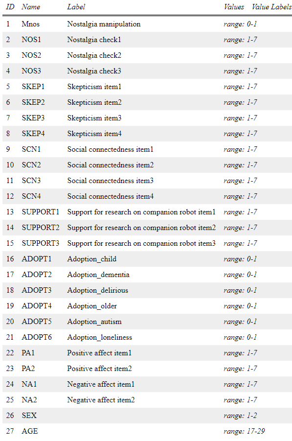
```

]


---

.pull-left[
## 数据

.footnotesize[
```{r}
library(tidyverse)
library(haven)
rawdat <- read_sav("data/Study 4/Study 4.sav")

d <- rawdat %>% 
  rowwise() %>% 
  transmute(
    Mnos           = Mnos,
    Nostalgia      = mean(c_across(starts_with("NOS"))),
    Skepticism     = mean(c_across(starts_with("SKEP"))),
    Social_connect = mean(c_across(starts_with("SCN"))),
    Support_robot  = mean(c_across(starts_with("SUPPORT"))),
    Adoption_robot =  sum(c_across(starts_with("ADOPT"))),
  ) %>% 
  ungroup() 
```
]

```{r, echo=FALSE}
d %>% 
  head(6) %>% 
  flextable::flextable() %>% 
  flextable::fontsize(size = 9, part = "all") %>% 
  flextable::line_spacing(space = 0.7) %>%
  flextable::autofit()
```

]


.pull-right[
```{r, echo=FALSE,out.width="90%"}
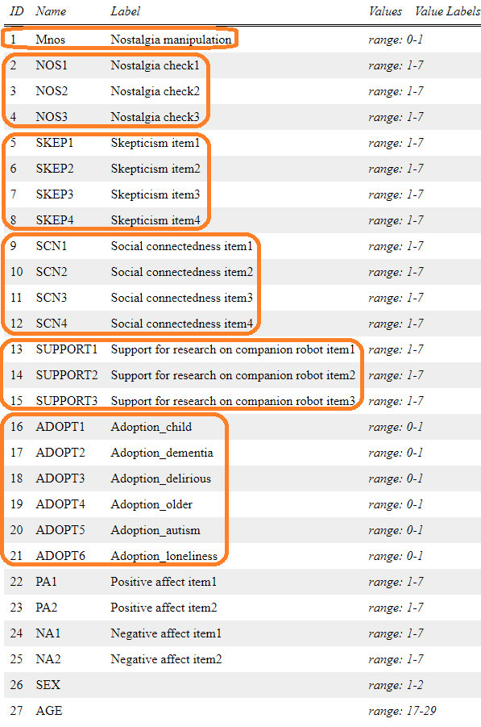
```

]


---
## Figure 5a

.pull-left[

```{r, echo=FALSE}
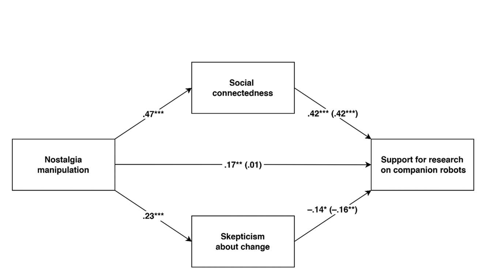
```

]


.pull-right[

]


---
## Figure 5a

.pull-left[

```{r, echo=FALSE}
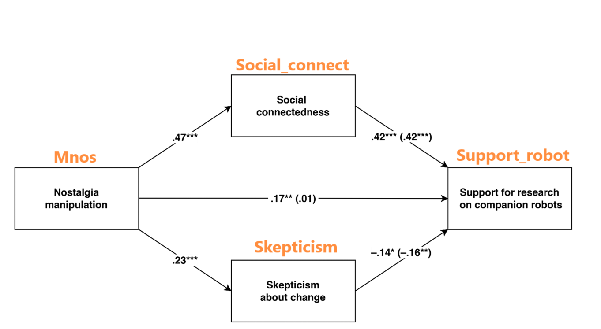
```

]


.pull-right[

]


---
## Figure 5a

.pull-left[

```{r, echo=FALSE}
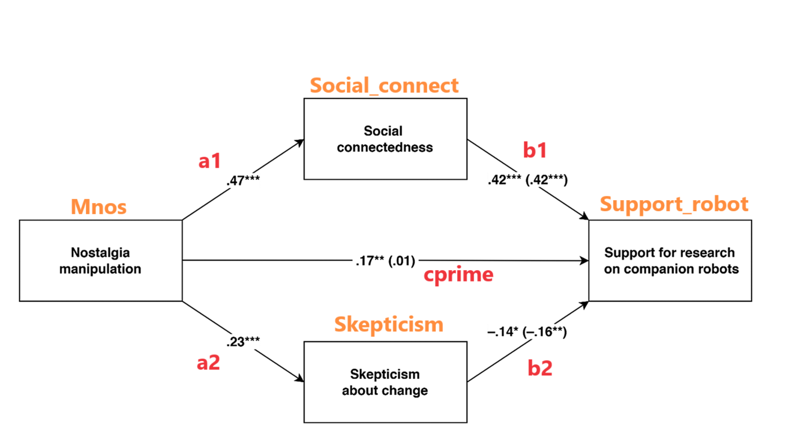
```

]


.pull-right[

.footnotesize[
```{r}
library(lavaan)

model <- '

  Social_connect ~ a1 * Mnos
  Skepticism     ~ a2 * Mnos

  Support_robot  ~ cprime * Mnos + b1 * Social_connect + 
                   b2 * Skepticism
  
  # define parameters
  a1b1      := a1 * b1 
  a2b2      := a2 * b2
  indirect  := a1 * b1 + a2 * b2
 

'


fit <- sem(model, 
           data      = d, 
           estimator = "MLR", 
           mimic     = "Mplus") 
```
]

]


---
## Figure 5a

.pull-left[

```{r, echo=FALSE}
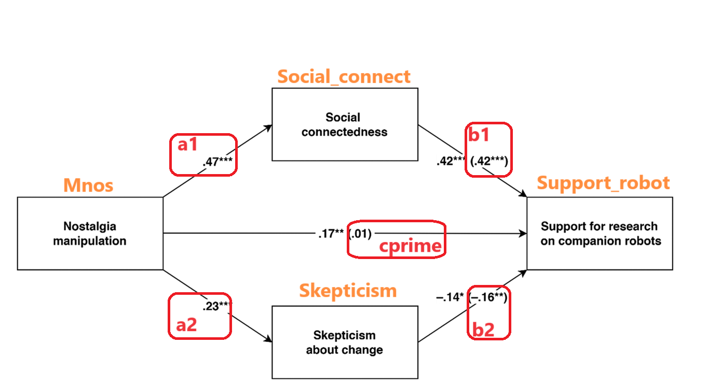
```

]


.pull-right[
.footnotesize[
```{r, eval=FALSE}
fit %>% 
  parameterestimates(standardized = T) %>%  
  filter(op %in% c("~", ":="))  %>% 
  select(label, est, se, pvalue, 
         ci.lower, ci.upper, std.all)
```
]

```{r, echo=FALSE}
tbl_orders <- c("a1", "b1", "a2", "b2", 
                "a1b1", "a2b2", "cprime", "indirect_effect")


fit %>% 
  parameterestimates(standardized = T) %>%  
  filter(op %in% c("~", ":="))  %>% 
  select(label, est, se, pvalue, ci.lower, ci.upper, std.all) %>% 
  arrange(factor(label, levels = tbl_orders)) %>% 
  flextable::flextable() %>% 
  flextable::colformat_double(digits = 4) %>% 
  flextable::color(j = "std.all", color = "red") %>% 
  flextable::autofit()
```


]


---
## Study 5a

.pull-left[


```{r, echo=FALSE}
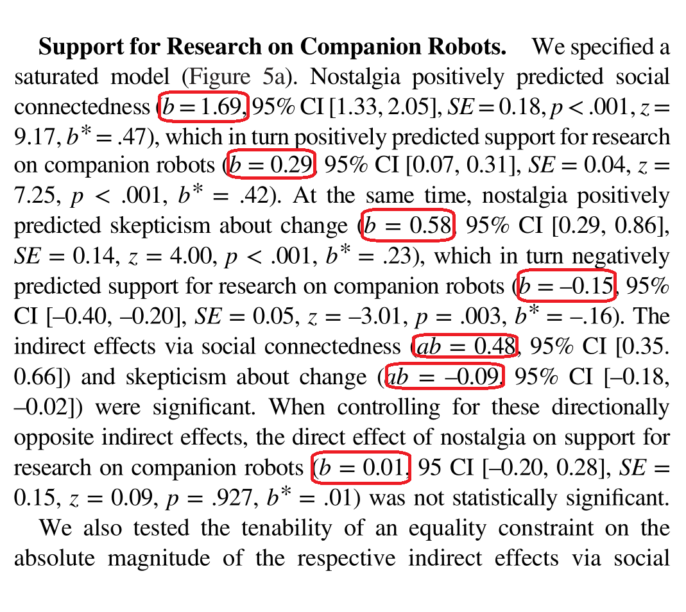
```

]


.pull-right[
.footnotesize[
```{r, eval=FALSE}
fit %>% 
  parameterestimates(standardized = T) %>%  
  filter(op %in% c("~", ":="))  %>% 
  select(label, est, se, pvalue, 
         ci.lower, ci.upper, std.all)
```
]

```{r, echo=FALSE}
tbl_orders <- c("a1", "b1", "a2", "b2", 
                "a1b1", "a2b2", "cprime", "indirect_effect")


fit %>% 
  parameterestimates(standardized = T) %>%  
  filter(op %in% c("~", ":="))  %>% 
  select(label, est, se, pvalue, ci.lower, ci.upper, std.all) %>% 
  arrange(factor(label, levels = tbl_orders)) %>% 
  flextable::flextable() %>% 
  flextable::colformat_double(digits = 4) %>% 
  flextable::color(j = "est", color = "red") %>% 
  flextable::autofit()
```


]


---
## Study 5a

.pull-left[


```{r, echo=FALSE}
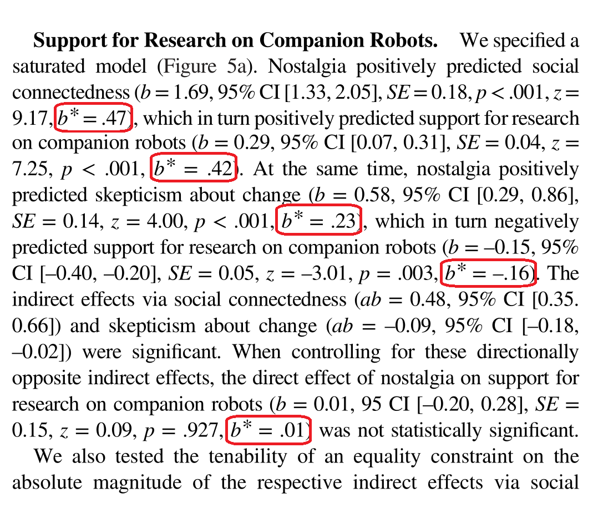
```

]


.pull-right[
.footnotesize[
```{r, eval=FALSE}
fit %>% 
  parameterestimates(standardized = T) %>%  
  filter(op %in% c("~", ":="))  %>% 
  select(label, est, se, pvalue, 
         ci.lower, ci.upper, std.all)
```
]

```{r, echo=FALSE}
tbl_orders <- c("a1", "b1", "a2", "b2", 
                "a1b1", "a2b2", "cprime", "indirect_effect")


fit %>% 
  parameterestimates(standardized = T) %>%  
  filter(op %in% c("~", ":="))  %>% 
  select(label, est, se, pvalue, ci.lower, ci.upper, std.all) %>% 
  arrange(factor(label, levels = tbl_orders)) %>% 
  flextable::flextable() %>% 
  flextable::colformat_double(digits = 4) %>% 
  flextable::color(j = "std.all", color = "red") %>% 
  flextable::autofit()
```


]


---
class: center, middle

# 贝叶斯 recode


---
## Figure 5a

.pull-left[

```{r, echo=FALSE}

```

]


.pull-right[

]


---
## Figure 5a

.pull-left[

```{r, echo=FALSE}

```

]


.pull-right[

```{r, echo=FALSE}
library(brms)
#mod %>%  readr::write_rds("./fits/mod.rds")
mod <- readr::read_rds("./fits/mod.rds")
```

.footnotesize[
```{r, eval=FALSE}
library(brms)

mod <- brm(
  bf(Social_connect ~ Mnos) +                                  #<<
    bf(Skepticism ~ Mnos) +                                    #<<
    bf(Support_robot ~ Mnos + Social_connect + Skepticism) +   #<<
    set_rescor(FALSE),                                         #<<
  
  family = gaussian,
  data   = d,
  chains = 4,
  cores  = 4
)
```
]
]


---

.pull-left[

## Study 5a
```{r, echo=FALSE}

```

]

--

.pull-right[

.footnotesize[
```{r, eval=FALSE}
draws <- as_draws_df(mod)

draws %>% 
  transmute(
    a1     = b_Socialconnect_Mnos,
    a2     = b_Skepticism_Mnos,
    cprime = b_Supportrobot_Mnos,
    b1     = b_Supportrobot_Social_connect,
    b2     = b_Supportrobot_Skepticism
  ) %>% 
  mutate(
    a1b1            = a1 * b1,
    a2b2            = a2 * b2,
    indirect_effect = a1 * b1 + a2 * b2
  ) %>% 
  pivot_longer(
    cols          = everything(),
    names_to      = "item",
    values_to     = "value"
  ) %>% 
  group_by(item) %>% 
  ggdist::mean_hdi(.width = .95)
```
]


```{r, echo=FALSE}
draws <- as_draws_df(mod)

tbl_orders <- c("a1", "b1", "a2", "b2", 
                "a1b1", "a2b2", "cprime", "indirect_effect")

draws %>% 
  transmute(
    a1     = b_Socialconnect_Mnos,
    a2     = b_Skepticism_Mnos,
    cprime = b_Supportrobot_Mnos,
    b1     = b_Supportrobot_Social_connect,
    b2     = b_Supportrobot_Skepticism
  ) %>% 
  mutate(
    a1b1            = a1 * b1,
    a2b2            = a2 * b2,
    indirect_effect = a1 * b1 + a2 * b2
  ) %>% 
  pivot_longer(
    cols          = everything(),
    names_to      = "item",
    values_to     = "value"
  ) %>% 
  group_by(item) %>% 
  ggdist::mean_hdi(.width = .95) %>% 
  arrange(factor(item, levels = tbl_orders)) %>% 
  flextable::flextable() %>% 
  flextable::colformat_double(digits = 3) %>% 
  flextable::line_spacing(space = 0.7) %>% 
  flextable::color(j = "value", color = "red") %>% 
  flextable::autofit()
```

]


---
## Bayesian interpretation


```{r, fig.width = 10, fig.asp= 0.45, echo=FALSE}
library(ggdist)
draws %>% 
  transmute(
    a1     = b_Socialconnect_Mnos,
    a2     = b_Skepticism_Mnos,
    cprime = b_Supportrobot_Mnos,
    b1     = b_Supportrobot_Social_connect,
    b2     = b_Supportrobot_Skepticism
  ) %>% 
  mutate(
    a1b1            = a1 * b1,
    a2b2            = a2 * b2,
    indirect_effect = a1 * b1 + a2 * b2
  ) %>% 
  pivot_longer(
    cols          = everything(),
    names_to      = "item",
    values_to     = "value"
  ) %>% 
  
  ggplot(aes(x = value)) +
  geom_vline(xintercept = 0, color = "grey50", linetype = 2) +
  geom_histogram(binwidth = .025, boundary = 0, 
                 color = "white", fill = "skyblue3", size = 1/4) +
  ggdist::stat_pointinterval(
    aes(y = 0), 
    point_interval = mode_hdi, .width = .95
  ) +
  scale_y_continuous(NULL, breaks = NULL) +
  xlab("posterior") +
  theme_bw() +
  theme(
    panel.grid = element_blank(),
    strip.background = element_rect(color = "transparent", fill = "transparent")
  ) +
  facet_wrap(vars(factor(item, levels = tbl_orders)), nrow = 2)
```


---
## 标准化后的结果

.pull-left[

```{r, echo=FALSE}

```

]

--

.pull-right[

```{r, echo=FALSE}
library(brms)
#mod_s %>%  readr::write_rds("./fits/mod_s.rds")
mod_s <- readr::read_rds("./fits/mod_s.rds")
```

.footnotesize[
```{r, eval=FALSE}
standardize <- function(x) {                       #<<
  (x - mean(x)) / sd(x)                            #<<
}                                                  #<<

d_s <- d %>%                                       #<<
  mutate(across(everything(), standardize))        #<<


mod_s <- brm(
  bf(Social_connect ~ Mnos) +                                  
    bf(Skepticism ~ Mnos) +                                    
    bf(Support_robot ~ Mnos + Social_connect + Skepticism) +   
    set_rescor(FALSE),                                         
  
  family = gaussian,
  data   = d_s,     #<<
  chains = 4,
  cores  = 4
)
```
]
]


---

.pull-left[

## 标准化后的结果
```{r, echo=FALSE}

```

]


.pull-right[

.footnotesize[
```{r, eval=FALSE}
draws <- as_draws_df(mod_s) #<<

draws %>% 
  transmute(
    a1     = b_Socialconnect_Mnos,
    a2     = b_Skepticism_Mnos,
    cprime = b_Supportrobot_Mnos,
    b1     = b_Supportrobot_Social_connect,
    b2     = b_Supportrobot_Skepticism
  ) %>% 
  mutate(
    a1b1            = a1 * b1,
    a2b2            = a2 * b2,
    indirect_effect = a1 * b1 + a2 * b2
  ) %>% 
  pivot_longer(
    cols          = everything(),
    names_to      = "item",
    values_to     = "value"
  ) %>% 
  group_by(item) %>% 
  ggdist::mean_hdi(.width = .95)
```
]


```{r, echo=FALSE}
draws <- as_draws_df(mod_s)

tbl_orders <- c("a1", "b1", "a2", "b2", 
                "a1b1", "a2b2", "cprime", "indirect_effect")

draws %>% 
  transmute(
    a1     = b_Socialconnect_Mnos,
    a2     = b_Skepticism_Mnos,
    cprime = b_Supportrobot_Mnos,
    b1     = b_Supportrobot_Social_connect,
    b2     = b_Supportrobot_Skepticism
  ) %>% 
  mutate(
    a1b1            = a1 * b1,
    a2b2            = a2 * b2,
    indirect_effect = a1 * b1 + a2 * b2
  ) %>% 
  pivot_longer(
    cols          = everything(),
    names_to      = "item",
    values_to     = "value"
  ) %>% 
  group_by(item) %>% 
  ggdist::mean_hdi(.width = .95) %>% 
  arrange(factor(item, levels = tbl_orders)) %>% 
  flextable::flextable() %>% 
  flextable::colformat_double(digits = 3) %>% 
  flextable::line_spacing(space = 0.7) %>% 
  flextable::color(j = "value", color = "red") %>% 
  flextable::autofit()
```

]


---
## 对比
<br>
```{r, fig.width = 8, fig.asp= 0.4, echo=FALSE}
 p1 <- fit %>%
   standardizedSolution(type = "std.all") %>%
   filter(op %in% c("~", ":=")) %>%
   filter(label %in% c("a1", "a2")) %>%
   ggplot(aes(x = est.std, y = label)) +
   geom_pointrange(aes(xmin = ci.lower, xmax = ci.upper)) +
   scale_x_continuous(limits = c(0, 0.6)) +
   labs(x = NULL, y = NULL, title = "Frequentist using lavaan") +
   theme_bw(base_size = 16)


 p2 <- draws %>%
   transmute(
     a1   = b_Socialconnect_Mnos,
     a2   = b_Skepticism_Mnos
   ) %>%
   pivot_longer(
     cols        = everything(),
     names_to    = "item",
     values_to   = "value"
   ) %>%
   ggplot(aes(x = value, y = item)) +
   ggdist::stat_halfeye(fill = "skyblue3") +
   labs(x = NULL, y = NULL, title = "Bayesian using brms") +
   theme_bw(base_size = 16)


 library(cowplot)
 plot_grid(p1, p2, align = "hv", axis = "tblr")
```


---
class: center, middle

# 练习题


---
## Figure 5b

.pull-left[

```{r, echo=FALSE}
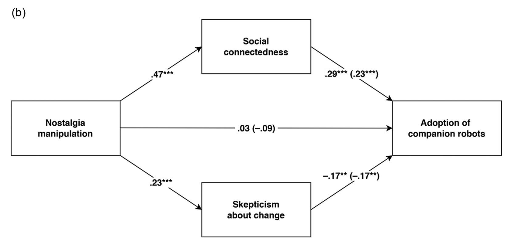
```

]


.pull-right[

]


---
## Study 5b

.pull-left[

```{r, echo=FALSE}
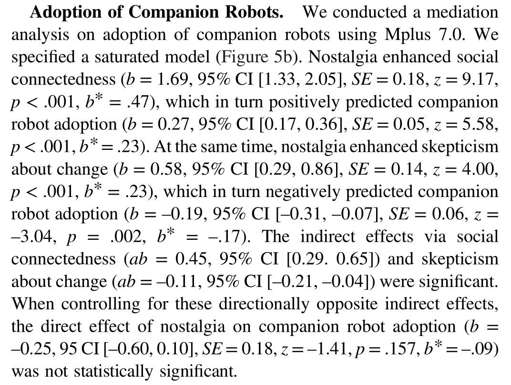
```

]


.pull-right[

]


---
class: center, middle

# 感谢 R 和 Stan 语言之美!

本幻灯片由 R 包 [**xaringan**](https://github.com/yihui/xaringan) 和 [**flipbookr**](https://github.com/EvaMaeRey/flipbookr) 生成

